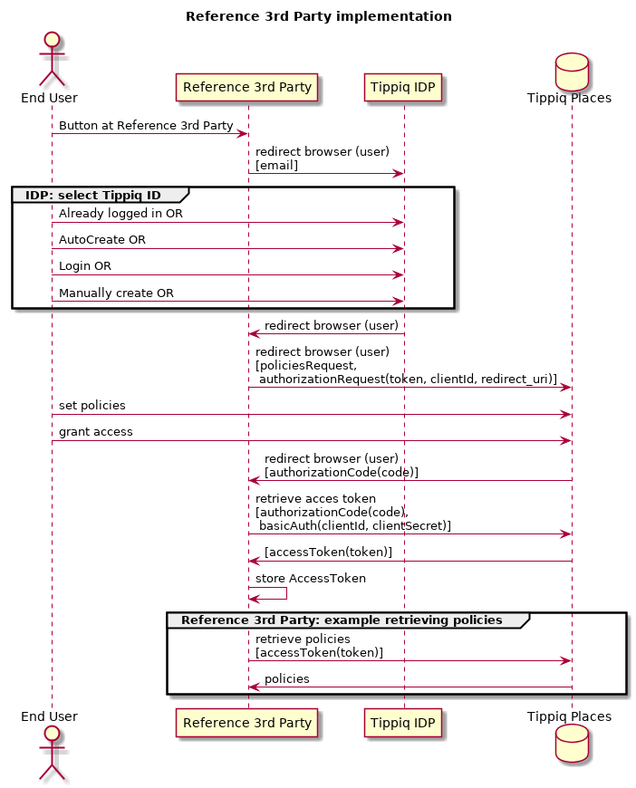

# Tippiq Reference 3p OSS

*Update 03-09-2017*: This repository is now published as open source software under the GPL 3 License (see the LICENSE file).

*Warning*: Please take the appropriate security measures before running this software in production.

# reference-3p
Reference 3rd Party application for testing the Tippiq policy authorization grant flow.

This project should not run in a production environment and is only made for demo and reference purposes.

For a more detailed description, see below.

### Installation (OSX, Linux, Windows)

**Prerequisites**

* [Node.js](https://nodejs.org/)
* [Git](http://git-scm.com/)

**Clone the project to your local machine**

    $ git clone https://github.com/alliander/tippiq-oss-reference-3p

**Install dependencies**

    $ npm install

**Run the app**

    $ npm start

**Open the browser**

Open [http://localhost:3015/](http://localhost:3015/) in your browser.

### How it works

This Reference 3rd Party project is an example implementation that serves as a reference implementation to using the Tippiq Places service.

**Tippiq Places**

Tippiq Places is a system that allows end users to represent and manage their digital house. It contains places (houses), attributes (such as the location) of a house, and policies (Huisregels). It consists of three main parts:

* `AuthorizationServer` -- The system managing authorization to resources.
* `ResourceServer` -- The system managing resources.
* `PlacesStore` -- The (front end) portal allowing end users to update their policies, places and authorization settings.

**Tippiq IDP**

To authenticate end users within the context of Tippiq Places, Tippiq provides an Identity Provider (Tippiq IDP) that is implemented using [OpenID Connect](http://openid.net/specs/openid-connect-core-1_0.html). The Tippiq IDP allows end users to register a `Tippiq ID` containing a digital house (identifiable by a `placeId`).

Note: Additionally, Tippiq IDP could also be logged in to third party web sites (and serve as a true Identity Provider ("Inloggen met Tippiq"). This is not relevant in the context of Tippiq Places.

Note: Since a Tippiq ID is a requirement for an end user to be able to manage their own policies, creating a Tippiq ID. To make this as less of a hassle as possible:

* an email address and password are required to create a TippiqID. In addition, a user has to create a place (containing a `placeId`) and select it for use with the third party.
* the email address can be prefilled from the requesting `Client`.
* the password can be auto-generated and set by the user at a later time.

**OAuth2**

Tippiq Places is implemented using [The OAuth2 Authorization Framework](https://tools.ietf.org/html/rfc6749), in particular the [Authorization Code grant type](https://tools.ietf.org/html/rfc6749#section-1.3.1).

Some important OAuth2 terminology:

* `Client` -- The party requesting access to a resource, in this example the `Client` will be the Reference 3rd Party.
* `ClientID` -- A (public) identifier representing the `Client`, supplied to the `Client` by the `AuthorizationServer`.
* `ClientSecret` -- A (private) secret used by the `Client` for Authentication purposes, supplied to the `Client` by the `AuthorizationServer`. The `ClientSecret` should be kept secret at all times.
* `AuthorizationRequest` -- The request sent by the `Client` to the `AuthorizationServer`. It consists of a request `token`, the `clientId` and a `redirect_uri`.
* `AuthorizationCode` -- A code representing the authorization grant that the end user granted to the `Client`. Should be used to obtain an `AccessToken`.
* `AccessToken` -- A token that can be used to obtain the actual resources (policies).

To make requesting certain policies easier, Tippiq Places features `PolicyTemplates.

* `PoliciesRequest` -- a set of policies that the Client requests the end user to set.

The `PoliciesRequest` is an array of policy template identifiers. Policies can be requested by including their identifiers (supplied by Tippiq) in the `PoliciesRequest`.

In this reference implementation only one policy is requested by its template identifier: `reference3p_test_policy`.

**Reference Third Party**

Summarized, it works like this:

* Tippiq supplies the `Client` (=Reference 3rd Party) with a `ClientID` and `ClientSecret`
* At some point in the `Client` asks the end user to
  * Sign in using a `Tippiq ID`
  * Select a house/place
    * This will return a `placeId` from `Tippiq ID` to the `Client`
  * Setup a certain (set of) policies (the `PoliciesRequest`).
  * Grant the `Client` access to these policies (the `AuthorizationRequest`) for a certain `placeId` (house)
* The end user sets their policies
* The end user grants access to their policies
  * By returning an `AuthorizationCode` to the `Client`
* The `Client` uses the `AuthorizationCode` to obtain an `AccessToken`
* The `Client` uses the `AccessToken` in combination with the `placeId` to read the end user's policies

### How this reference implementation works

**Configuration**

The application can be configured using environment variables (see section below) or by editing the file `api/config.js`.

**Starting point**

The `index.html` page functions as the entry point of this reference implementation. It is a fictional signup flow for _Reference 3rd Party_ to demonstrate how a prefered email address can be passed from _Reference 3rd Party_ to Tippiq Places. The screen also functions as an introduction that the user will be using Tippiq to control his or her policies.

After entering a name and/or email address, clicking on 'Privacy-voorkeuren instellen' will redirect the user to the `TIPPIQ_IDP_URL`, where the user will be asked to associate with a TippiqID account and a house (place/placeId) that is assosiated to this account. The `ClientId` is also sent to the TIPPIQ_IDP_URL so the TIPPIQ_IDP_URL can show which party is requesting the user to associate with a TippiqID.

Note: The `TIPPIQ_IDP_URL` is fetched from the backend using a separate http request. The `/api/settings` endpoint called exposes configuration settings needed by the frontend. In production this is usually done by injecting the `TIPPIQ_IDP_URL` into the frontend using a templating engine.

**Requesting policies and access**

After completing the Tippiq IDP authentication, Tippiq IDP will redirect the end user to `REFERENCE_3P_REQUEST_POLICIES_URL` (i.e. http://localhost:3015/api/request_policies). It will add the `placeId` to the session token that is passed in the `token` query parameter.

This is a basic backend page that constructs a `PoliciesRequest` combined with an OAuth2 `AuthorizationRequest` and redirects the end user to the `TIPPIQ_PLACES_URL` with the`placeId` appended (i.e. https://huis-acc.tippiq.nl/huis/`placeId`/huisregels) with the `PoliciesRequest` and `AuthorizationRequest` parameters as query parameters, i.e. `https://huis-acc.tippiq.nl/8ae398fa-e2ed-457b-875f-38042e1ac2f1/huisregels?token=someToken&clientId=b63d545a-0633-11e6-b686-bb1d47039b65&response_type=code&policiesRequest=reference3p_test_policy`. This basic backend page also makes sure that the `placeId` will be stored in a session cookie of the end user's browser.

Note: Multiple policies can be requested by adding the `policiesRequest` GET parameter multiple times with different values.

**Retrieving and storing the AccessToken**

After setting the requested policies on Tippiq Places and completing the AuthorizationRequest, Tippiq Places will redirect the end user to `REFERENCE_3P_GRANT_URL` (i.e. http://localhost:3015/bedankt.html) with the `AuthorizationCode` as a query parameter in the response.

The `bedankt.html` page reads the `AuthorizationCode` query parameter (`code`) and passes it to the (reference-3p) backend (i.e. `/api/policies`), along with the `placeId` that is stored in a cookie.

The backend first calls the `TIPPIQ_POLICIES_ACCESS_TOKEN_URL` to exchange the `AuthorizationCode` for an `AccessToken`. Note that the `TIPPIQ_POLICIES_ACCESS_TOKEN_URL` is a secured url that can only be accessed by authenticating using the `CliendID` and the `ClientSecret` (using HTTP Basic Auth).

After the backend retrieves the `AccessToken`, it should store this token for later use.

**Using the AccessToken to read the end user's policies**

In this reference implementation, we immediately show how future use would work by fetching the end users policies and displaying them on the `bedankt.html` page.

This is why the backend doesn't store the `AccessToken` but immediately uses it to fetch the user's policies at the `TIPPIQ_PLACES_URL`. For this, it needs the `placeId`. These policies are then returned to the frontend (`bedankt.html`) and displayed on the screen.

### Integration guidelines

* Use Tippiq colors for all Tippiq buttons (i.e. `#60cda4`).
* There is no complex crypto involved, so usually constructing urls and requests manually is simple enough.
* Never expose the `ClientSecret` to anyone else but Tippiq (make sure to check SSL certificates).
* Never expose the `AccessToken` to anyone else but Tippiq (make sure to check SSL certificates).
* Always use SSL/HTTPS.
* Open redirect urls in the same browser window, not in popups or new tabs/windows.
* For background info check the OAuth2 specification.

### Environment variables

The implementation requires a set of configuration settings to be set. The defaults can be overwritten by setting environment variables. The defaults themselves are available in `api/config.js`.

    $ export CLIENT_ID=<value>

The defaults (for testing) are:

* `REFERENCE_3P_REQUEST_POLICIES_URL` = http://localhost:3015/api/request_policies
* `REFERENCE_3P_FAILURE_URL` = http://localhost:3015/api/failure
* `REFERENCE_3P_GRANT_URL` = http://localhost:3015/bedankt.html
* `TIPPIQ_IDP_URL` = https://id-acc.tippiq.nl/selecteer-je-huis
* `TIPPIQ_POLICIES_ACCESS_TOKEN_URL` = https://huis-acc.tippiq.nl/api/oauth2/token
* `TIPPIQ_PLACES_URL` = https://huis-acc.tippiq.nl/api/policies

On production these urls should be used (and HTTPS should always be enabled):

* `TIPPIQ_IDP_URL` = https://id.tippiq.nl/selecteer-je-huis
* `TIPPIQ_POLICIES_ACCESS_TOKEN_URL` = https://huis.tippiq.nl/api/oauth2/token
* `TIPPIQ_PLACES_URL` = https://huis.tippiq.nl

For testing, `CLIENT_ID`, `CLIENT_SECRET` are already included in de default configuration. For production, these values will be supplied by Tippiq after request.

### Demo environment / Test servers

Tippiq IDP lives at:

    https://id.tippiq.nl/
    https://id-acc.tippiq.nl/ (for testing purposes)

Tippiq Places lives at:

    https://huis.tippiq.nl/
    https://huis-acc.tippiq.nl/ (for testing purposes)
